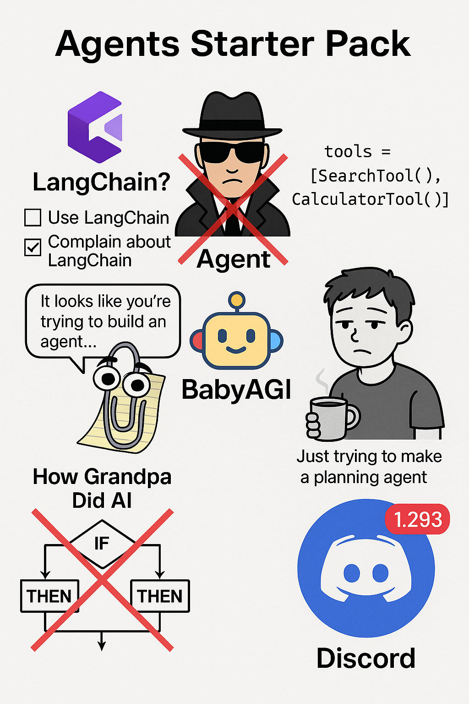

# Agent Starter Kit

A JavaScript-based framework for building AI agents, inspired by React's design principles. The framework provides a declarative, component-based approach to building agents while maintaining simplicity and extensibility.



## Features

- Declarative programming style
- Component-based architecture
- Easy onboarding and setup
- Composable components
- Simple component interfaces
- Props-based data flow
- Hook-based extensibility
- Functional programming approach
- Explicit state management
- Abstracted LLM context window management
- XML/JSX-based agent definitions

## Installation

1. Clone the repository:
```bash
git clone https://github.com/yourusername/agent-starter-kit.git
cd agent-starter-kit
```

2. Install dependencies using npm:
```bash
npm install
```

3. Set up your environment variables:
```bash
cp .env.example .env
# Edit .env and add your Anthropic API key
```

## Quick Start

1. Create an agent definition in XML format (e.g., `test.xml`):
```xml
<TestAgent systemPrompt="You are a helpful assistant that can answer questions and help with tasks.">
    <TimeTool />
    <WeatherTool />
</TestAgent>
```

2. Create your tools (e.g., in `tools/weather.js`):
```javascript
const weather = async (attributes, inputs) => {
    const weather = 'sunny, 70 degrees, and 5 mph winds';
    return weather;
};

weather.input_schema = {
    type: 'object',
    properties: {
        location: { type: 'string', description: 'The location to get the weather in' }
    }
};

weather.description = 'Get the weather in a given location';

module.exports = { weather };
```

3. Run your agent:
```javascript
const agentModule = require('./agentBase');
const agentParser = require('./agentParser');
const agentRuntime = require('./agentRuntime');

// Parse and create the agent
const parsedAgent = agentParser.parseAgentFileByName('test');
const agent = new agentModule.Agent(parsedAgent);

// Run the agent with a prompt
agentRuntime.run(agent, "What's the weather and time in San Francisco?");
```

## Tools

Tools are the building blocks of your agent's capabilities. Each tool is a JavaScript module that exports:
- An async function that implements the tool's functionality
- An `input_schema` object defining the expected inputs
- A `description` string explaining the tool's purpose

Example tool structure:
```javascript
const myTool = async (attributes, inputs) => {
    // Tool implementation
    return result;
};

myTool.input_schema = {
    type: 'object',
    properties: {
        // Define your input parameters here
    }
};

myTool.description = 'Description of what the tool does';

module.exports = { myTool };
```

To use a tool in your agent, simply include it in your XML definition:
```xml
<MyAgent>
    <MyTool />
</MyAgent>
```

## Core Components

### AgentRuntime

The foundation of the framework is the `AgentRuntime` class, which implements the basic agent formula:
```
agent = while loop + llm + tools
```

#### Core Methods

1. **Constructor**
   - Initializes with default Anthropic model
   - No system prompt by default
   - No tools by default

2. **Chainable Setters**
   - `setSystemPrompt(message: string) -> AgentRuntime`
   - `setModel(model: string) -> AgentRuntime`
   - `setTools(tools: Tool[]) -> AgentRuntime`
   - `setBeforeToolCallListener(callback: Function) -> AgentRuntime`
   - `setAfterToolCallListener(callback: Function) -> AgentRuntime`
   - `setBeforeAssistantMessageListener(callback: Function) -> AgentRuntime`
   - `setAfterAssistantMessageListener(callback: Function) -> AgentRuntime`

3. **Core Methods**
   - `run(prompt: string) -> Promise<string>`: Main execution method

## Examples

Check out the `examples/` directory for more usage examples.

## Contributing

Contributions are welcome! Please feel free to submit a Pull Request.

## License

MIT